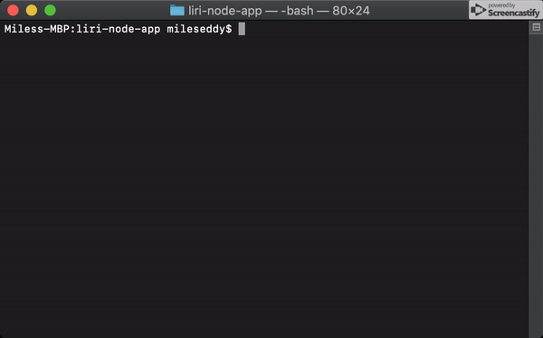

# liri-node-app
LIRI-Bot. LIRI is a Language Interpretation and Recognition Interface. LIRI will be a command line node app that takes in parameters and gives you back data.
   * `concert-this`
   

   * `spotify-this-song`
    
   * `movie-this`
   

   * `do-what-it-says`
   
   
LIRI is like iPhone's SIRI. However, while SIRI is a Speech Interpretation and Recognition Interface, LIRI is a Language Interpretation and Recognition Interface. LIRI will be a command line node app that takes in parameters and gives you back data.

